# PONDERADA ALU
Esse projeto consiste na implementação de uma ALU (Unidade Lógica e Aritmética) de 8 bits.

## O que é o projeto
Uma ALU é a parte de um processador responsável por realizar operações lógicas e aritméticas. Nesse projeto, implementei operações de soma, subtração, multiplicação, shift lógico, NAND e XOR de 8 bits, além dos registradores necessários para o funcionamento do multiplicador.

## Como foi feito

### Portas Lógicas
O ponto de partida de todo o projeto foi a porta NAND. A partir dela derivei todas as outras portas lógicas, NOT, AND, OR e XOR, já que a partir da NAND conseguimos fazer qualquer outra porta. As versões de 8 bits dessas portas basicamente são 8 portas de 1 bit operando em paralelo, fazendo a operação bit a bit.

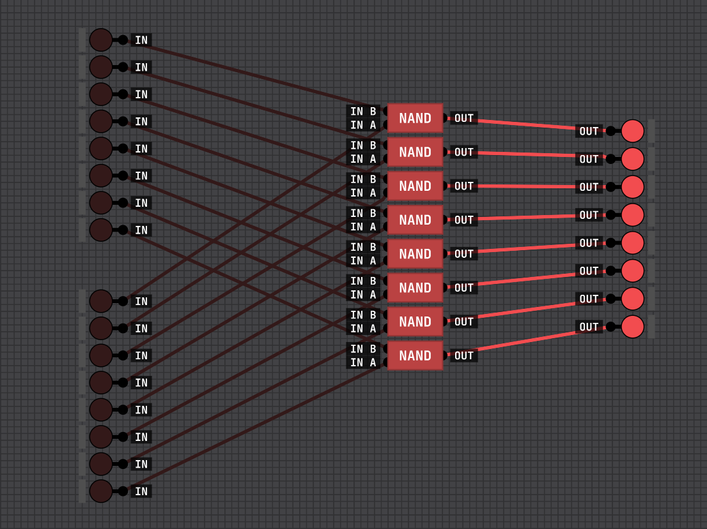
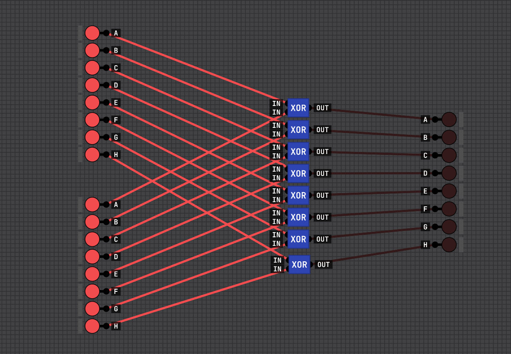

### Somador
Com as portas prontas, construi o somador. O somador de 1 bit recebe A, B e Cin e gera a soma e o Cout. O de 4 bits é feito encadeando quatro somadores de 1 bit, propagando o Cin, e o de 8 bits encadeia dois de 4 bits.

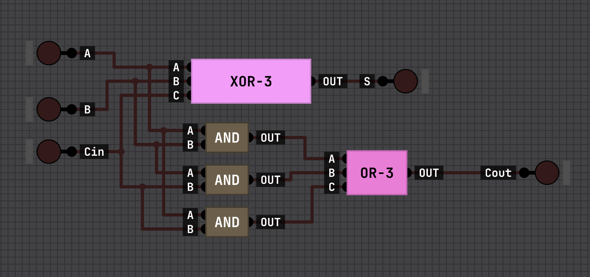
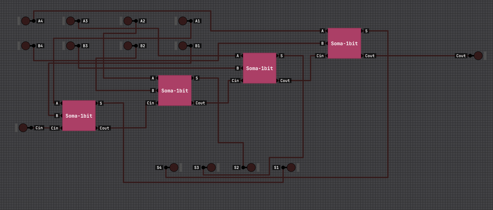
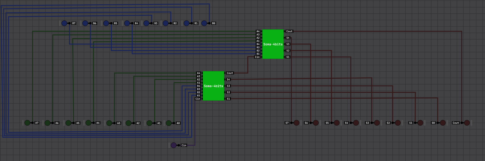

### Subtrator
O subtrator segue a mesma lógica, mas invertendo a entrada B e o Cin antes de entrar no somador, além de inverter o Cout na saída, implementando a subtração por complemento.

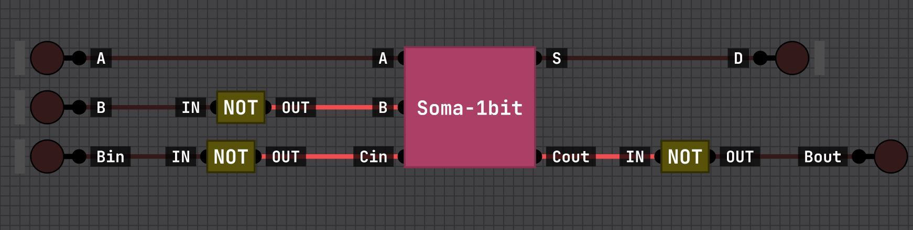
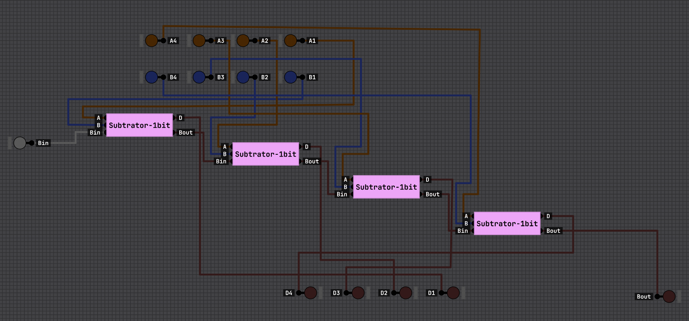
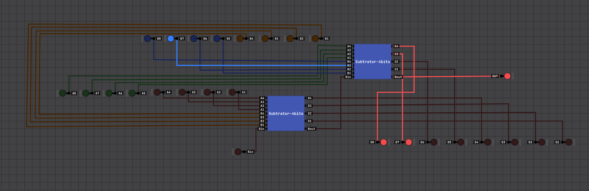

### Shift Lógico
O shift lógico não utiliza portas lógicas, ele é feito só com fiação, conectando cada bit uma posição acima ou abaixo dependendo da direção do deslocamento.

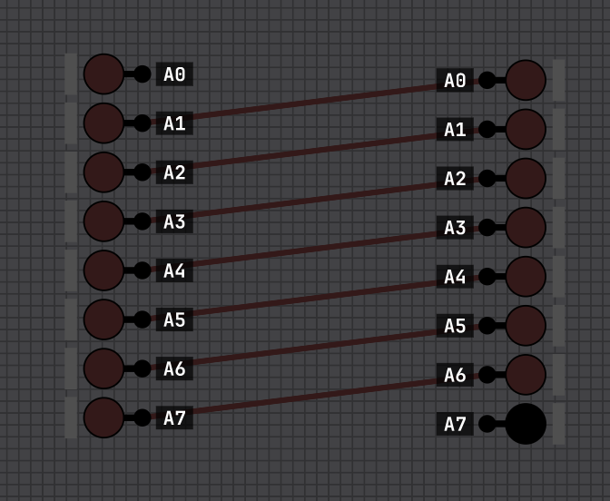
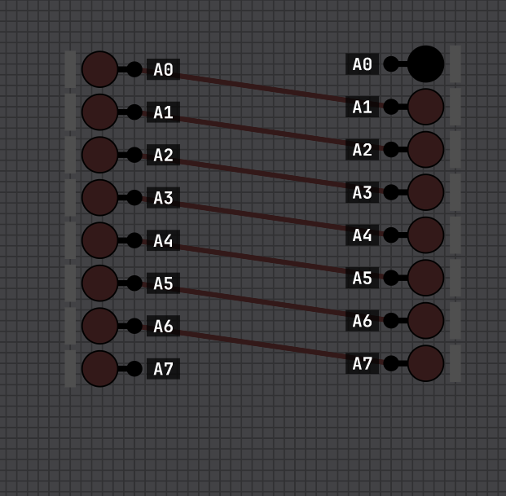

### Multiplicador
A parte mais complexa foi o multiplicador, que implementei usando o método Shift,and,Add. Esse método processa um bit do multiplicador por vez a cada ciclo de clock, acumulando o resultado ao longo de 8 ciclos. O circuito é dividido em quatro blocos principais.

, O Registrador A que armazena o multiplicando e permanece fixo durante toda a operação.

, O Registrador MQ que armazena o multiplicador e desloca seus bits para a direita a cada clock, com cada estágio composto por um MUX 4:1 e um flip,flop D.
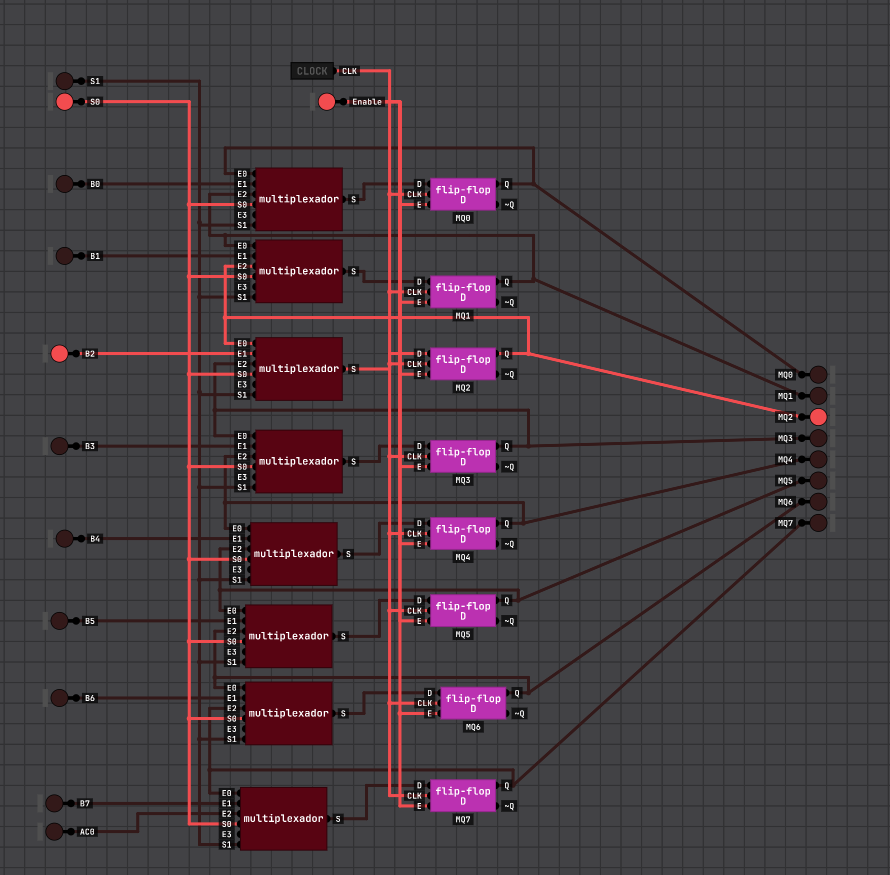
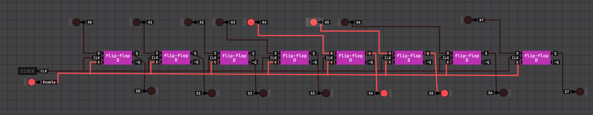

, O Registrador AC que é responsável por acumular as somas parciais e tem uma estrutura parecida com a do MQ, mas com a diferença de que sua entrada de carga vem de um MUX de decisão , que escolhe entre manter o valor atual ou carregar o resultado da soma AC + A, dependendo do valor do bit MQ0.
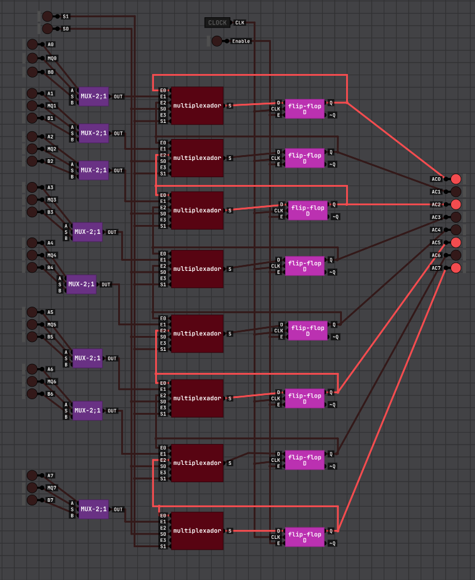

, O somador de 8 bits que calcula AC + A constantemente, e o MQ0 decide a cada ciclo se esse valor será carregado no AC ou não.
Assim, após 8 ciclos de clock, os 8 bits mais significativos do resultado ficam no AC e os 8 menos significativos no MQ.
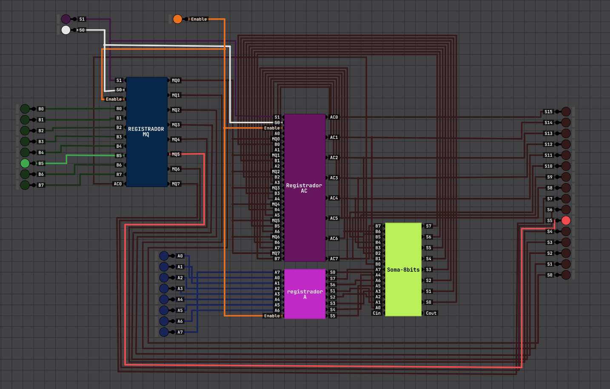

Dificuldades encontradas
A principal dificuldade foi a implementação do multiplicador, já que ele permanece com alguns problemas devido à falta de um contador e fiação incorreta paraa o acumulador. Resultadno em um projeto um pouco incompleto.

## Vídeo explicativo,
https://youtu.be/NebTUMEgQXg?si=q,18wFOc1uC99C2q

